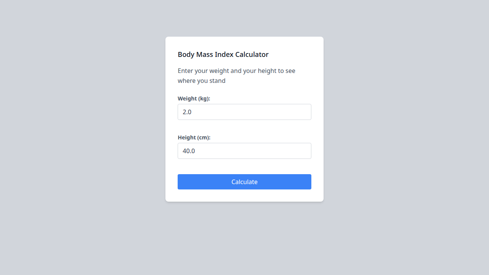
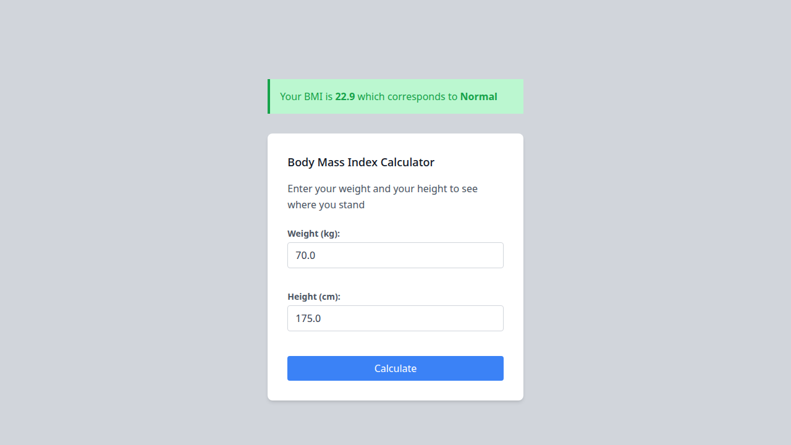
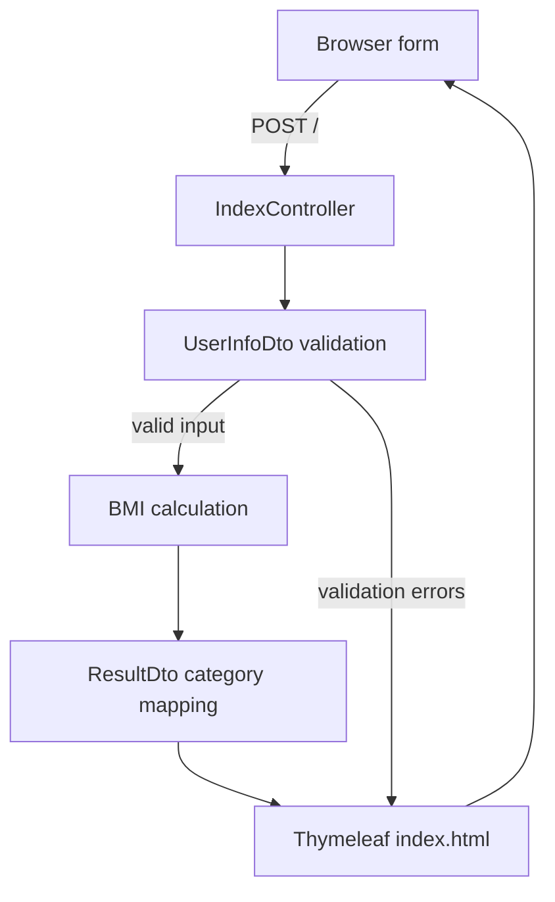

# BMI Calculator

A small server-rendered web application that calculates Body Mass Index (BMI) from a user's weight and height. It combines **Java**, **Spring Boot**, **Thymeleaf**, **Maven**, and **Tailwind CSS** in a focused example of form handling, validation, view rendering, and domain-specific calculation logic.

> **Note:** BMI is a general screening measure, not a medical diagnosis. The category labels in this project are implemented by the application code and should not be treated as clinical advice.

[](https://www.oracle.com/java/technologies/javase/jdk11-archive-downloads.html)
[](https://spring.io/projects/spring-boot)
[](https://maven.apache.org/)

## Contents

- [Overview](#overview)
- [Features](#features)
- [Demo](#demo)
- [How the calculation works](#how-the-calculation-works)
- [Architecture](#architecture)
- [Technology choices](#technology-choices)
- [Getting started](#getting-started)
- [Testing and packaging](#testing-and-packaging)
- [Project structure](#project-structure)
- [Validation and edge cases](#validation-and-edge-cases)
- [Security and privacy](#security-and-privacy)
- [Limitations and future improvements](#limitations-and-future-improvements)
- [Author](#author)

## Overview

BMI Calculator gives a user a simple form for entering **weight in kilograms** and **height in centimeters**. After submission, the Spring Boot application validates the values, converts height to meters, calculates BMI, rounds it to one decimal place, and renders the result with a category label.

The project is intentionally small. Its value is in showing the complete path from an HTML form to server-side validation, calculation logic, and a rendered response without introducing a database, authentication, or a separate frontend framework.

## Features

- Server-rendered BMI calculator UI using Thymeleaf.
- Weight and height input fields with HTML constraints and server-side Bean Validation.
- BMI calculation with height conversion from centimeters to meters.
- Result rounding to one decimal place.
- Category mapping for Underweight, Normal, Overweight, and three obesity classes.
- Inline validation messages when submitted values fail the DTO constraints.
- Responsive layout utilities supplied by Tailwind CSS.
- JUnit tests covering application startup and BMI category mapping.

## Demo

### Initial form



### Example result

The verified example below uses **70 kg** and **175 cm**. The application displays a BMI of **22.9** and the category **Normal**.



There is no permanent hosted deployment configured for this repository. Run the application locally using the instructions below.

## How the calculation works

The controller converts the submitted height from centimeters to meters and applies the standard BMI formula:

```text
BMI = weight (kg) / height² (m²)
```

For example:

```text
70 / 1.75² = 22.9
```

The result is rounded to one decimal place before it is passed to `ResultDto`. The current implementation maps values using these thresholds:

| BMI range | Application label |
| --- | --- |
| `< 19` | Underweight |
| `19` to `< 25` | Normal |
| `25` to `< 30` | Overweight |
| `30` to `< 35` | Obesity class 1 |
| `35` to `< 40` | Obesity class 2 |
| `>= 40` | Obesity class 3 |

These thresholds describe the behavior implemented in `ResultDto`; they are not presented as medical guidance.

## Architecture

This is a compact Spring MVC application with server-side HTML rendering:



### Component responsibilities

- **`IndexController`** handles `GET /` and `POST /`. It creates the initial form model, checks validation results, performs the calculation, and returns the `index` view.
- **`UserInfoDto`** holds weight and height values. Bean Validation annotations define the server-side numeric limits, and `getComputedHeight()` converts centimeters to meters.
- **`ResultDto`** stores the rounded BMI and assigns the application's category label.
- **`index.html`** is the Thymeleaf template that renders the form, validation messages, and result alert.
- **`main.css`** contains the generated Tailwind CSS used by the template.

There is no separate service layer, persistence layer, REST API, authentication flow, or JavaScript application in the current implementation.

## Technology choices

### Java

Java was chosen for its strong typing, mature standard library, and broad ecosystem. In this project it provides a clear structure for the controller, DTOs, validation annotations, and calculation logic. The Maven configuration targets Java 11 or newer.

### Spring Boot

Spring Boot provides application bootstrapping, dependency management through the Spring Boot parent, an embedded Tomcat server, Spring MVC request handling, and integration with Thymeleaf and Bean Validation. The project uses Spring Boot `2.6.7`.

### Thymeleaf

Thymeleaf keeps the UI server-rendered and integrates directly with the Spring MVC model. The template can display submitted values, validation messages, and the calculated result without a client-side framework.

### Tailwind CSS

Tailwind CSS supplies utility classes for the layout, spacing, typography, colors, responsive widths, borders, and focus states used by the form. The source entry point is `styles/input.css`, and the generated stylesheet is written to `src/main/resources/static/css/main.css`.

### Maven

Maven manages the Java dependencies, test lifecycle, compilation, packaging, and Spring Boot run goal. The repository includes the Maven Wrapper, so contributors can use `./mvnw` without installing Maven globally.

## Getting started

### Prerequisites

- JDK 11 or newer.
- Node.js and npm, or Yarn, if you want to regenerate the Tailwind stylesheet.
- A shell environment capable of running the Maven Wrapper.

### Run locally

From the repository root:

```bash
cd bmi-main
./mvnw spring-boot:run
```

Then open [http://localhost:8000](http://localhost:8000). The port is configured in `src/main/resources/application.properties`.

### Regenerate Tailwind CSS

The repository includes a generated stylesheet, so this step is not required for a normal run. Use it when changing Tailwind classes or the source stylesheet:

```bash
cd bmi-main
npm install
npm run build:css
```

For continuous CSS rebuilding during development:

```bash
npm run css
```

## Testing and packaging

Run the automated tests:

```bash
cd bmi-main
./mvnw test
```

The test suite currently includes an application context test and category-mapping tests for `ResultDto`.

Create an executable JAR:

```bash
./mvnw clean package
```

Run the packaged application:

```bash
java -jar target/bmi-1.0.jar
```

The build was verified locally with `./mvnw test package` after pinning Lombok to `1.18.30`, which keeps the existing code compatible with the available JDK 21 environment while preserving the project's Java 11 target.

## Project structure

```text
bmi-calculator/
├── README.md
├── docs/
│   └── images/
│       ├── bmi-calculator-form.png
│       └── bmi-calculator-result.png
├── .vscode/
│   ├── launch.json
│   └── settings.json
└── bmi-main/
    ├── pom.xml
    ├── mvnw
    ├── mvnw.cmd
    ├── package.json
    ├── tailwind.config.js
    ├── styles/
    │   └── input.css
    └── src/
        ├── main/
        │   ├── java/com/tericcabrel/bmi/
        │   │   ├── BmiApplication.java
        │   │   ├── configs/WebConfig.java
        │   │   ├── controllers/IndexController.java
        │   │   ├── dtos/ResultDto.java
        │   │   ├── dtos/UserInfoDto.java
        │   │   └── utils/Constants.java
        │   └── resources/
        │       ├── application.properties
        │       ├── static/css/main.css
        │       └── templates/index.html
        └── test/
            └── java/com/tericcabrel/bmi/
                ├── BmiApplicationTests.java
                └── dtos/ResultDtoTest.java
```

## Validation and edge cases

Server-side validation currently enforces:

- Weight from `2` through `800` kilograms.
- Height from `40` through `300` centimeters.

The HTML form additionally declares browser-side limits of `0`–`800` for weight and `20`–`250` for height. The server-side DTO is the authoritative validation path when a form is submitted. Invalid values return the form view with field-level error messages rather than calculating a result.

The current code does not provide dedicated handling for extremely large numeric values beyond the declared bounds, and it does not include custom error handling for malformed requests outside normal browser form submission.

## Security and privacy

The application does not use a database, user accounts, authentication, or persistent storage. The submitted height and weight are processed for the request and rendered in the response. No privacy, security, or production-readiness claim is made beyond that observed behavior.

The repository includes Spring Boot Actuator as a dependency, but it does not define custom management endpoints or a deployment configuration.

## Limitations and future improvements

The project is suitable as a focused learning application, but it is not presented as a complete health platform. Reasonable next steps would include:

- Add controller-level tests for valid submissions and validation failures.
- Align the HTML and DTO ranges so users see the same limits on both sides.
- Improve validation message wording and accessibility semantics.
- Add a dedicated service or calculator class if the domain logic grows.
- Add a CI workflow to run tests on pull requests.
- Add a deployment guide if a permanent hosting target is selected.
- Add optional history or persistence only if the product requirements justify storing user data.

## Author

**Abhishek K Doddagoudar**

- GitHub: [abhishekk-1804](https://github.com/abhishekk-1804)


[1]: https://spring.io/projects/spring-boot "Spring Boot project documentation"
[2]: https://www.thymeleaf.org/doc/tutorials/3.0/thymeleafspring.html "Thymeleaf and Spring tutorial"
[3]: https://tailwindcss.com/docs/utility-first "Tailwind CSS utility-first fundamentals"
[4]: https://maven.apache.org/guides/getting-started/maven-in-five-minutes.html "Maven in five minutes"
[5]: https://www.cdc.gov/bmi/adult-calculator/bmi-categories.html "CDC adult BMI categories"
